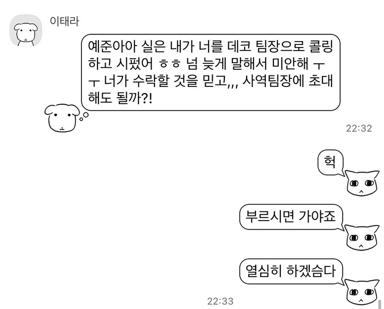
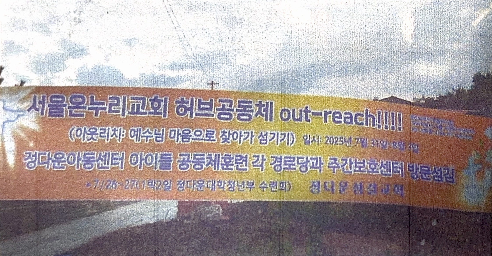
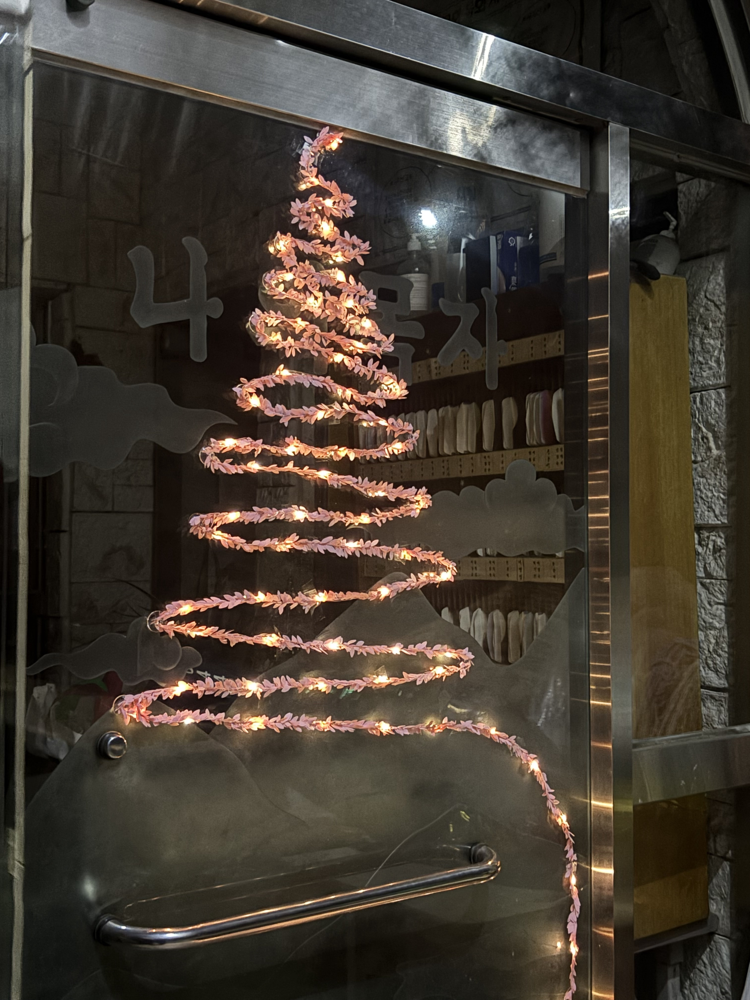

<figure style="text-align: center; margin: 40px 0;">
  
  <figcaption style="font-size: 0.9em; color: #666; margin-top: 10px;">
  Safari의 읽기 도구를 켜주세요!
  </figcaption>
</figure>

인생 첫 사역이었는데, 감사하게도 데코팀 팀장으로 불러주셨다!!

데코 구상을 하며 이리저리 돌아다니다가 예배당 뒷쪽 게시판에 목사님의 롤링 페이퍼를 보게 되었다.  
그 안에 공통된 문장들이 “목사님께서 사역하시는 모습이 예수님 같으시다” 였다. 

그 글을 보자마자 이 구절이 떠올랐다. 사실 빌립보서 몇장 몇절 말씀인지 몰라서 한참 찾았다. 여기에서 말하는 “이 마음”은:

목사님이 나눠주신 책자에 있던 사진 한 장이 ‘아웃리치’라는 단어를 가장 잘 설명해 주는 것 같았다.

---

예배당도 꾸몄다!

---

**나도 바보처럼 살래요**

산 위에서 세상 모르고  
배만 만드는 노아  
당신 참 바보 같군요  
당신 정말 바보 같군요  

왜 맑은 날 배를 만드나요  
왜 하필 높은 산 위에  
당신 참 바보 같군요  
당신 정말 바보 같군요  

눈부신 해가 하늘 높이 뜨면  
비의 약속 잊을만한데  
날마다 듣는 조롱에  
그 외로운 길 포기할 만한데  

당신은 어쩜 그리  
묵묵히 그 길 가나요  
당신은 어쩜 그리  
그 자리를 지켜냈나요  

당신 참 바보 같군요  
당신 정말 바보 같군요  
당신 참 바보 같군요  
나도 바보처럼 살래요
---
마지막 날 목사님 깜짝 블레싱을 위한 찬양이다.
처음 들어보는 찬양이었고 가사가 웃기다고만 생각했지만 마지막 날 목사님 블레싱을 준비할 때 가사를 보며 눈물이 살짝 났다.

가사가 이춘명 목사님의 사역과도 너무 잘 맞아떨어졌다. 세상이 이해하지 못하는 지역에서, 한계와 아픔 속에서도 묵묵히 사랑과 섬김의 씨앗을 뿌리시는 목사님. 사모님이 떠나신 후의 상처에도 멈추지 않고, 성령님을 의지하며 순종하시는 그 모습!

세상이 “바보 같다”고 손가락질해도,
맑은 날 산 위에서 배를 만드는 노아처럼,
한계 속에서도 성령님을 전적으로 의지하며 조건 없는 사랑으로 이웃을 품으시는 이춘명 목사님처럼 나도 바보처럼 살아가야겠다.
---
기도제목을 적는 벽이 있었는데, “담대하게 그리스도의 향기를 전할 수 있는 사람이 되게 해주세요” 라고 적었다.  

[Oceans (Where Feet May Fail) - Hillsong UNITED](https://youtu.be/dy9nwe9_xzw)

재수를 하고 아직 대학에 들어가지도 못한 내가 너무 부족하다고 느꼈다. 너무 편하게 살아왔고 특출나게 잘 하는 것도 없는데!!

하나님께서 나에게 계획하신 길이 있고, 다양한 사람들과 상황들을 이정표로 세우시며 그 길을 안내해주심을 믿는다.

매일 살아가며 하는 결정과 행동들이 하나님께서 알려주시는 이정표를 따르는지, 사탄의 유혹을 따르는지 분별할 수 있는 능력이 필요하다.

믿음이 부족하다. 예수님의 몸에 난 못자국을 눈으로 보고 손으로 만지기 전까지는 믿지 않았던 도마처럼 보이지 않으면 잘 믿지 않는다. 어렸을 때부터 그래왔다. 비누로 손을 씻어도 세균이 죽는 것이 보이지 않아 유치원 다닐 때에는 물로만 손을 씻기도 했다. 

주님 저에게 믿음이 필요합니다. 
하나님께서 세우신 이정표를 믿음으로 따라가게 하옵소서.

요즘 걱정이 많다. 중고등학생 때 그저 공부만 하며 온실 속의 화초처럼 자란 탓인지, 세상에 나아갈 용기가 참 부족하다. 모든 일이 처음 하는 일이여서 너무나 두렵고 용기가 없어 고민만 하다가 결국 포기하는 경우가 대부분이다.

하지만 아무도 내 곁에 없다고 느껴질 때, 항상 나와 함께하시는 임마누엘 하나님을 기억하고 싶다. 설령 넘어진다 해도 하나님 안에서 넘어지는, 그런 삶을 살고 싶다!!

또 열정 그룹!! 각자의 자리에서 주어진 달란트로 섬기는 모습이 너무 멋져 보였다. 나도 내 달란트를 얼른 찾아서 하나님이 보시기에 좋게 활용하고 싶다.

---

크리스마스 때 여행도 가고 여러 행사에 참여해 봤지만, 올해가 가장 따뜻한 성탄절이었어요.

첫 사역이라 진짜 어리버리했는데 다들 도와주셔서 너무 감사하고 더욱 성장해서 아웃리치 베테랑이 되겠습니다!

사랑하고 축복합니다!!
